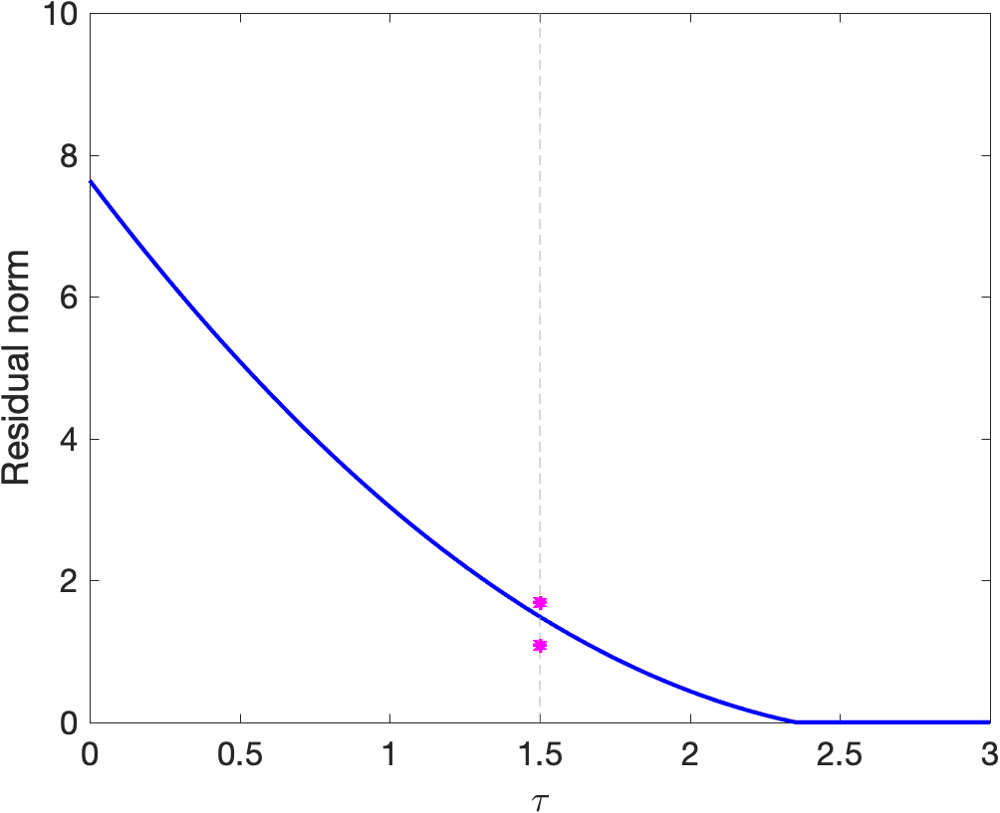

Options
===========================================

Below we discuss the available options in the form ``options.<name>``. These values can be set directly in the options structure, or can be provided as key-value pairs with ``<name>>`` as the key. Some examples for option usage are as follows:

::
 
 % Direct specification of parameters
 [x,r,g,info] = spgl1(A,b,tau,'classic','iterations',1000,'verbosity',0);

 % Separate preparation of the options
 options = spgSetParams('classic','iterations',1000,'verbosity',0);
 [x,r,g,info] = spgl1(A,b,tau,options);

 % Manual creation of the options structure
 options = struct();
 options.iterations = 1000;
 options.verbosity  = 0;
 [x,r,g,info] = spgl1(A,b,tau,options);

 % Function call with mixed structure and key-value pair parameters
 [x,r,g,info] = spgl1(A,b,tau,'classic',options,'mu',0);

Predefined option sets
------------------------------

TODO

Output options
------------------------------

**options.fid** gives the file identifier used for output. By default it is set to 1 (standard output), but it can be set to a file opened with ``fopen`` to redirect the output to a file.

**options.verbosity** controls the level of output ranging for no output (0) to all output (3).

**options.history** boolean flag that indicates whether the norms of the iterates, residuals, and gradient values should be recorded per iteration. By default the recording of the history is disabled.

Resource limits
------------------------------

**options.iterations** gives the maximum allowed number of iteration. By default this value is set to ten times the number of rows in A. If the maximum number of iterations is reached, the solver returns with an  ``EXIT_ITERATIONS`` error status.

**options.maxMatvec** gives the maximum allowed number of products with A or its transpose. When exceeded, the solver returns with an ``EXIT_MATVEC_LIMIT`` error status.

**options.maxRuntime** gives the maximum runtime in seconds. To keep the overhead of checking to a minimum, the runtime limit is checked approximately every 0.5 seconds. When the maximum runtime is exceeded, the solver returns with an ``EXIT_RUNTIME`` error status.

Problem settings
------------------------------

**options.iscomplex** indicates whether the problem has complex or real x. SPGL1 can typically determine this automatically, but it helps to set the flag when dealing with complex variables.

**options.mu** gives the regularization parameter :math:`\mu`. By default this value is set to 0.

Optimality conditions
-------------------------------

**options.bpTol** specifies the tolerance for declaring a basis-pursuit solution (status ``EXIT_BPSOL_FOUND``) when solving a Lasso problem. The exact stopping criterion used is that the residual norm is less than ``options.bpTol`` times the norm of input parameter b.

**options.lsTol** specifies the tolerance for declaring a least-squares solution (status ``EXIT_LEAST_SQUARES``). The exact stopping criterion used is that the gradient norm is less than or equal to ``options.lsTol`` times the norm of the residual.

**options.optTol** specifies the tolerance for declaring an optimal solution (status ``EXIT_OPTIMAL``). This condition is met when the relative duality gap is less than or equal to ``options.optTol`, where the relative duality gap is defined as the difference between the primal and dual solution divided by the maximum of the current primal value and ``options.relgapMinF``. In basis-pursuit mode, this parameter is also used to determine when to initiate a root-finding step. An illustration of primal and dual feasible points for a Lasso subproblem is given below:

   Pareto curve along with primal and dual feasible points.
 

**options.projTol** specifies the tolerance for projection. This variable is mostly for internal use, and it set to ``options.optTol`` by default for backward compatibility. If the projection was found to be inaccurate the solver will exit with the ``EXIT_PROJECTION`` status.

**options.relgapMinF** is used to define the relative duality gap. Tis value is obtained by dividing the primal-dual gap by the maximum of ``options.relgapMinF`` and the primal objective. By default, this parameter is set to 1.

**options.relgapMinR** is used to define the relative residual error. This value is obtained by dividing the different between the residual norm and sigma by the maximum of ``options.relgapMinR`` and the residual norm. By default, this parameter is set to 1.

Primal and dual norms
------------------------------

The following options must be set together and provide a consistent combination of primal norm, dual norm, and orthogonal projection. The weights can be used as part of the norm, or set to the empty vector ``[]``.

**options.weights** vector of weights for the primal norm.

**options.primal_norm** function that computes the primal norm of a given input vector, along with the weights.

**options.dual_norm** function that computes the dual norm of a given input vector, along with the weights for the primal norm.

**options.project** function that computes the orthogonal projection onto a ball of radius :math:`\tau`, as induced by the primal norm.

Root-find mode
------------------------------

**options.rootfindMode** - as explained in the `Pareto curve<pareto.html>`_ section there are two modes for root finding: the primal root-finding mode and the dual root-finding mode. Set this option to 0 for the primal mode, and to 1 for the dual mode.

**options.rootfindTol** - in the dual root-finding mode, this parameter can be set to a value between 0 and 1 to indicate when root finding should be enabled. Values close to 1 require stricter sub-problem solves, whereas values closer to 0 allow relaxed subproblem solves, at the cost of a potentially larger number of sub-problems. By default this value is set to 0.5.

Subspace minimization
-------------------------------

SPGL1 supports subspace minimization when solving (weighted) one-norm minimization problems.

**options.hybridMode** is a boolean parameter that specified whether subspace minimization should be activated.

**options.lbfgsHist** gives the number of vectors in the L-BFGS approximation, when using subspace minimization.

Line search
-------------------------------

**options.nPrevVals** indicates the number of previous objective values used for non-monotone line search.

**options.stepMin** indicates the minimum step length for Barzilai-Borwein scaling.

**options.stepMax** indicates the maximum step length for Barzilai-Borwein scaling.
